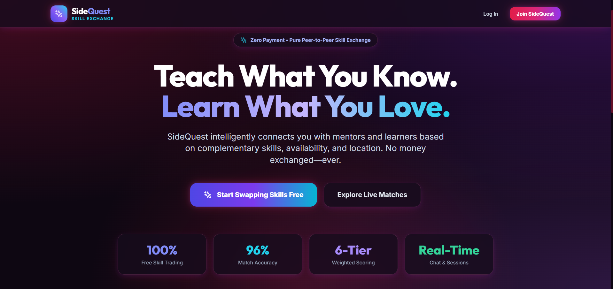
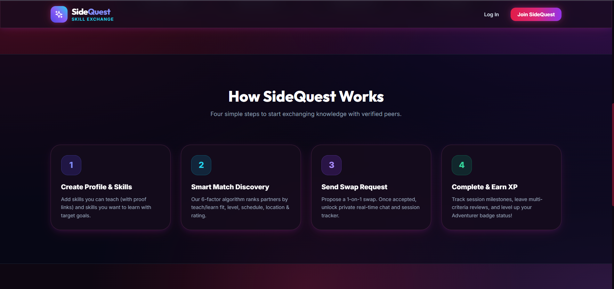
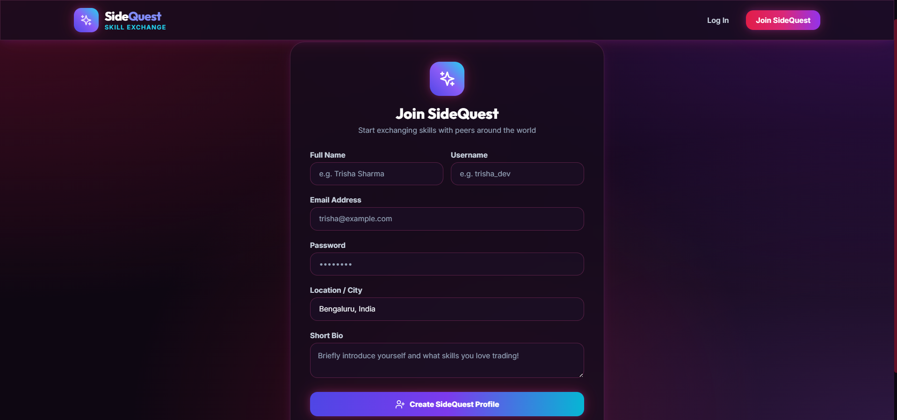

# 🚀 SideQuest – Skill Exchange Platform

SideQuest is a full-stack MERN web application that enables people to exchange skills instead of money. Users can teach what they know and learn what they don't by connecting with compatible learners based on their skills, interests, and proficiency levels.

---

## 🌟 Features

- 🔐 Secure User Authentication (JWT)
- 👤 User Profiles with Multiple Skills
- 📊 Skill Proficiency Levels
- 🤝 Intelligent Skill Matching
- 💬 Real-time Chat (Socket.io)
- 📅 Learning Session Scheduling
- ⭐ Reviews & Ratings
- 🏆 Gamification System (XP & Badges)
- 🔔 Real-time Notifications
- 👨‍💼 Admin Dashboard
- 🌐 Responsive UI

---

## 🛠 Tech Stack

### Frontend
- React.js
- Vite
- Tailwind CSS
- Axios
- Context API

### Backend
- Node.js
- Express.js
- JWT Authentication
- Socket.io
- Bcrypt

### Database
- MongoDB Atlas
- Mongoose

### Deployment
- Vercel (Frontend)
- Render (Backend)

---

## 📂 Project Structure

```
SideQuest/
│
├── client/                 # React Frontend
│   ├── src/
│   ├── components/
│   ├── pages/
│   └── services/
│
├── server/                 # Express Backend
│   ├── controllers/
│   ├── middleware/
│   ├── models/
│   ├── routes/
│   ├── services/
│   └── config/
│
├── README.md
└── package.json
```

---

## ⚡ Installation

Clone the repository

```bash
git clone https://github.com/trishadm/SideQuest.git
```

Go into the project

```bash
cd SideQuest
```

### Install Frontend

```bash
cd client
npm install
```

### Install Backend

```bash
cd ../server
npm install
```

---

## ▶ Running the Project

### Backend

```bash
cd server
npm run dev
```

### Frontend

```bash
cd client
npm run dev
```

---

## 🔑 Environment Variables

Create a `.env` file inside the `server` directory.

```
PORT=
MONGO_URI=
JWT_SECRET=
CLIENT_URL=
CLOUDINARY_CLOUD_NAME=
CLOUDINARY_API_KEY=
CLOUDINARY_API_SECRET=
```

---

## 📸 Screenshots

### Landing Page





### Dashboard


### Chat


### Profile


### Login 



---

## 🧠 Future Improvements

- AI-powered mentor recommendations
- Video calling
- Skill certificates
- Learning progress analytics
- Mobile application
- Calendar synchronization
- Email notifications

---

## 👩‍💻 Author

**Trisha D M**

GitHub: https://github.com/trishadm

---

## 📄 License

This project is licensed under the MIT License.